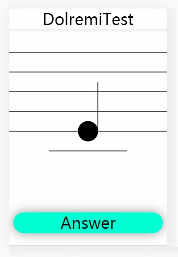

# DolremiTest

一个非常简易的APP，帮助你学习五线谱。

A simple app that can help you to learn musical.

警告！这个项目正在重构！你所下载到的最新版本并不是完整的！请使用git reset命令回退到c8033422e版本上！

```bash
git reset --hard c8033422ed64e39bf263615bb93d89398baf2a3b
```



# Get Started  如何开始

1.Download dolremi.html

2.Put it on your server or your mobile phone

3.Enjoy it!

1.下载dolremi.html

2.把它放在服务器或是手机上

3.尽情的享用香喷喷的五线谱吧！

# 关于开源协议

仓库中DolremiTest本身(doremi.html)，以及通过该程序衍生得产品，如Demo视频，均属于开源软件，遵守GNU通用公共许可证，即GNU GPL。

GNU GPL协议授予程序接受人以下权利，或称“自由”：

- 以任何目的运行此程序的自由；

- 再发行复制件的自由；

- 改进此程序，并公开发布改进的自由。

GNU GPL不会授予许可证接受人无限的权利。再发行权的授予需要许可证接受人开放软件的源代码，及所有修改。且复制件、修改版本，都必须以GPL为许可证，这是为了确保任何使用者不会独自占有开源软件。使用、复制或更改DolremiTest的程序接受人视为同意GNU GPL协议，必须再次开源其更改后的派生物（如源代码等），否则将追究法律责任。

关于协议版本，DolremiTest使用GPL v2协议。

关于GPL v2协议，上述说明仅做参考，具体细节请以LICENSE为准，DolremiTest原作者Jackie Lin(用户名lyj00912，<https://github.com/lyj00912> )保留一切解释权。